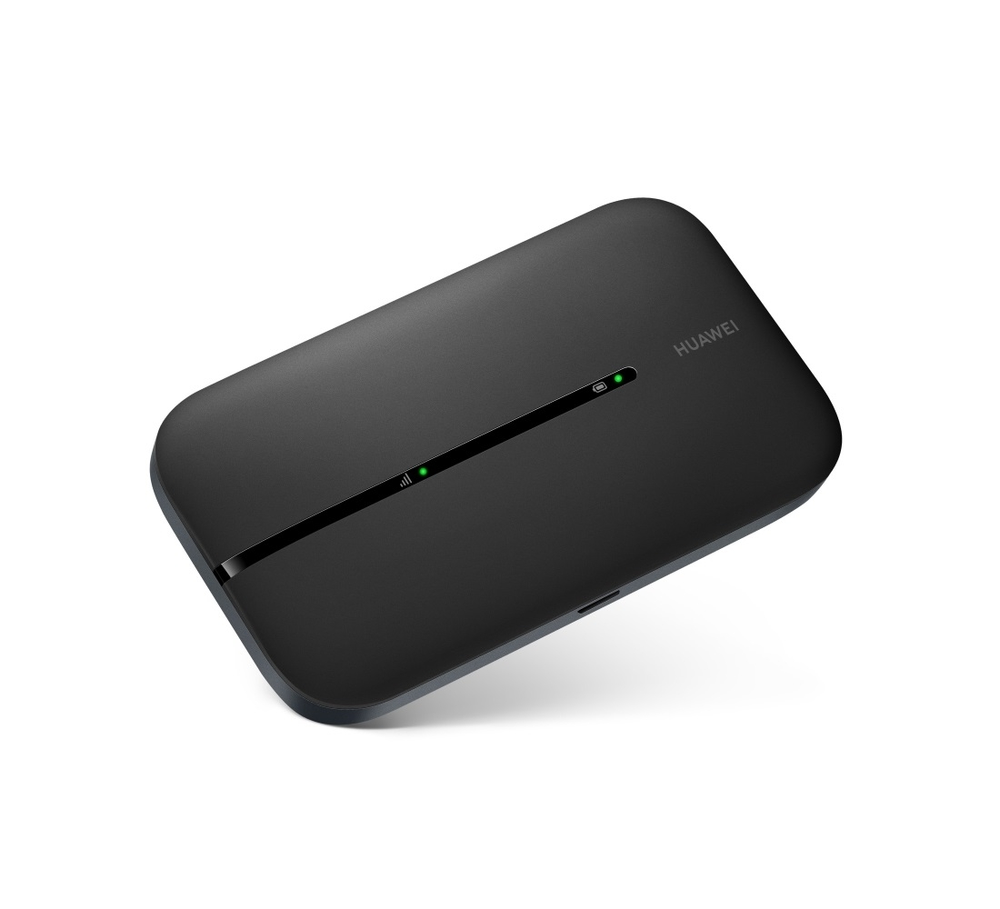

# {{ title }}

This page collects possible issues you might experience and solutions to them, but in general you can always contact us directly through Airbnb and we'll do our best to reply as soon as possible.

For serious emergencies, please **call 112, the European emergency number** which will redirect you to the most appropriate service.

## The lights have gone out

Homes in Italy have lower electricity limits than in some other countries.
This means the power can cut out if too many appliances are used at the same time.

To avoid this:

- don’t use several high-power appliances together (for example, the oven, washing machine and hairdryer)
- switch off one appliance before turning on another if you need to use several

If the power does go off, turn off some appliances and reset the main switch (ask us how to do this in the Airbnb chat).

## The wifi does not work

On Airbnb, we do not list wifi as one of the services, but we still give guests access to a pocket wifi device. It's not always reliable and it has a data limit, so it's unsuitable to working from home or other intense wifi usages, which is why we do not advertise it.

Having said that, it should be enough for watching some YouTube or any other streaming platform you have an account for, using the Chromecast.

The wifi name and password are visible from your Airbnb booking (ask in the chat if you can't find them).

If you do not see the wifi network at all from your device or the Chromecast, please check that the pocket wifi router is powered on and charging (it should be plugged in). The wifi device looks like the picture below:

## The fridge is off

The fridge can be off for three reasons:

1. [There’s been a power outage](#there-s-been-a-power-outage)  
2. [The fridge switch is off](#the-fridge-switch-is-off)  
3. [The fridge temperature is set to zero](#the-fridge-temperature-is-set-to-zero)

### There’s been a power outage

In this case, follow the instructions written above for [when the power goes out](#the-lights-have-gone-out), remembering to turn off at least one of the running appliances (often turning off the washing machine or the oven is enough).

### The fridge switch is off

The fridge has an external switch near the cooker. It can sometimes be turned off by mistake — to turn it back on, just flip the switch to the position shown in the photo (reactivating it).

The switch is the first one to the right of the hob, the one marked with the on/off labels (I/O).

### The fridge temperature is set to zero

This can happen if we forgot to turn the fridge back on after a period without guests. To fix it, simply turn the dial inside the fridge to position 2. You’ll see the fridge light turn back on immediately.

